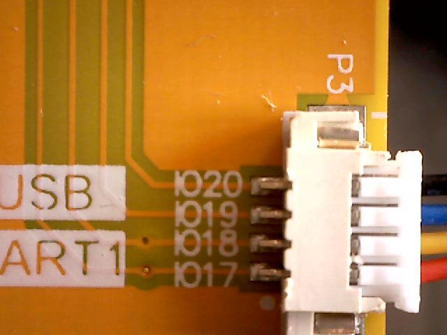

## The Sunton ESP32-8048S070 Board Reverse Engineered

Documentation of this board is abysmal. The best source I coud find is [here](http://specs.buho.ch/MCU/ESP32-8048S070/) ([mirror](https://static.mah.priv.at/public/ESP32-8048S070/)).

## Summary:

There are 2 I2C buses and 1 SPI bus available

* SDA1=IO19 SCL1=IO20  - Touch controller, also on P3
* SDA0=IO17 SCL=IO18 - external connectors P4, P5
* MISO=IO13 MOSI=IO11 SCLK=12 - TF card and external connector P2

The role of IO19 on P2 is unclear - seems to be SDA of the touch controller (?)

AFAICT there is no freeGPIO pin beyond these buses. By just using I2C1 (touch controller) one could disable I2C0 and use IO17 and IO18 as GPIO pins.

This means the SPI connector cannot be used since a second chip select pin is not available.

## P1 - next to USB

The RX and TX pins are the 3.3V versions of the console serial pins and also connect ot the CH340C serial/USB converter pins TXD and RXD - so still the console port as TTL signal, not a separate UART.

## P2 - label: SPI

HC-1.25-4PWT 1.25mm SMD connector

IO19 is labeled USB-PW R-DM; since USB/JTAG is not used, this pin seems to be free for SPI device select or other purposes

| Pin  | Signal name | Used for | Code example | source                                                                                                             | Purpose   |
| ---- | ---------------- | -------- | ----------------- | ------------------------------------------------------------------------------------------------------------------ | --------- |
| IO13 | MCU_MISO         | SD_D0    | SDcard            | [ESP32-8048S070-MCU-V1.1.png](https://static.mah.priv.at/public/ESP32-8048S070/Schematic/ESP32-8048S070-MCU-V1.1.png) | SPI MISO  |
| IO12 | TF_CLK           | SD_CLK   | SDcard            |                                                                                                                    | SPI CLOCK |
| IO11 | MCU_MOSI         | SD_CMD   | SDcard            |                                                                                                                    | SPI MOSI  |
| IO19 | USB-PW R-DM      | Select?  | SDA1 (?)          |                                                                                                                    |           |

                                                                                                  | no idea   |

## P3 - label: USB/UART

HC-1.25-4PWT 1.25mm SMD connector

| Pin  | Signal name | used for                                          |  |  |
| ---- | ---------------- | ------------------------------------------------- | - | - |
| IO20 | USB?             | SCL1 of Touch controller                         |  |  |
| IO19 | n/a              | SDA1 of Touch controller, same pin as P2/IO19 (?) |  |  |
| IO18 | UART1            | SCL0 (?)                                          |  |  |
| IO17 | n/a              | SDA0  (?)                                        |  |  |

## P4 - unlabeled, 1.25mm

HC-1.25-4PWT 1.25mm SMD connector

| Pin  | Signal name | used for |  |  |
| ---- | ---------------- | -------- | - | - |
| IO18 |                  | SCL0     |  |  |
| IO17 |                  | SDA0     |  |  |
| 3.3V |                  |          |  |  |
| GND  |                  |          |  |  |

## P5 - unlabeled, Stemma - same as P4

Stemma connector, 1mm SH-1.0-4PWB, standard pin usage for I2C, same pins and ordering as P4

## FPC1 - Touch Controller

9 pins total, 4 of which are GND

| number | Label | usage                 | IO pin |
| ------ | ----- | --------------------- | ------ |
| 6      | VDD   | 3.3v                  |        |
| 5      | INT   | TP_INT                | n/c?   |
| 4      | REST  | Touch ctrl reset line | IO38   |
| 3      | SCL   | SCL1                  | IO20   |
| 2      | SDA   | SDA1                  | IO19   |
| 1      | GND   |                       |        |

Seems the touch controller IRQ pin is not connected, so polling required

## TF Card Connections

Seems the Card Detect switch (pin 9, CD) is not connected, although it goes into a through-hole?

